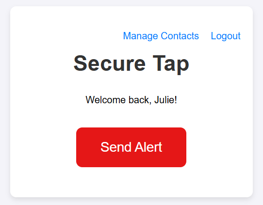
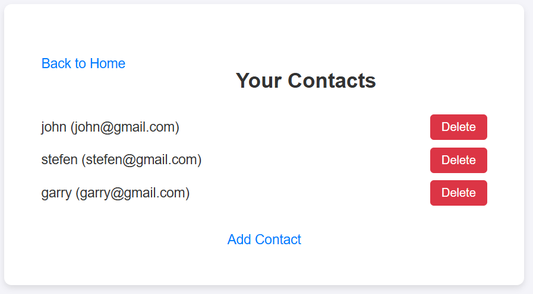

# Secure Tap - Emergency Alerts System

## Abstract
The **Emergency Alerts System** is a Django-based web application designed to enhance safety and communication during emergencies. This application allows users to manage emergency contacts and send urgent alerts to them with a single click. The system helps users quickly notify their contacts about an emergency by sharing their location and a predefined alert message.

## Features

### User Management
- **Sign Up**: Create a new account to use the application.
- **Login/Logout**: Secure authentication using Django's built-in features.
- **Superuser Access**: Admins can manage users, contacts, and alerts directly from the admin panel.

### Emergency Contact Management
- **Add Contacts**: Users can add emergency contacts with names, phone numbers, and email addresses.
- **View Contacts**: View all added contacts in a list format.
- **Delete Contacts**: Remove contacts as needed.

### Alert System
- **Send Alerts**: Users can send a predefined alert message with their location to all added contacts instantly.
- **View Sent Alerts**: Users can view a history of all the alerts they've sent.

## Screenshots
### Homepage

### Contacts management

### Sent alerts

## Technical Overview

### Backend
- **Framework**: Django
- **Database**: SQLite (default; easily switchable to other databases like PostgreSQL or MySQL)
- **Authentication**: Django's built-in user authentication system

### Frontend
- **Templates**: HTML, styled with basic CSS
- **Dynamic Views**: Rendered using Django's template engine

## Usage

### Home Page
- **Logged Out Users**: Options to log in or sign up.
- **Logged In Users**: Options to send an alert or manage contacts.

### Sending Alerts
- Predefined alert message: `"ALERT: Emergency! Location: VIT, Kovvada, Bhimavaram, WG Dist, AP."`
- Click the **"Send Alert"** button to notify all saved contacts.

### Managing Contacts
- Add, view, and delete emergency contacts from the contacts page.

### Viewing Sent Alerts
- Navigate to the **"Sent Alerts"** page to view all alerts sent by the logged-in user.

### Admin Panel
- Use the **superuser credentials** to log in and manage users, contacts, and alerts.

## Future Enhancements
1. **Real-Time Notifications**: Add SMS or push notification functionality.
2. **Location Services**: Integrate dynamic location detection.
